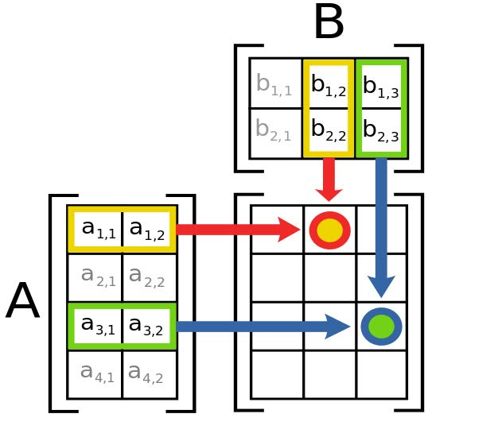
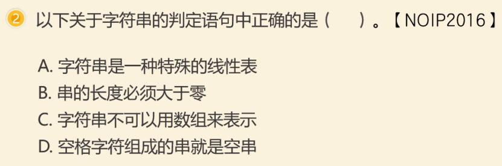
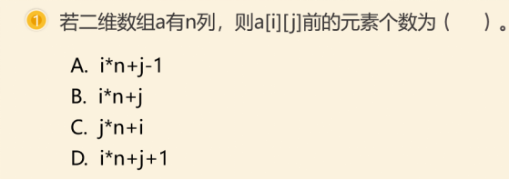
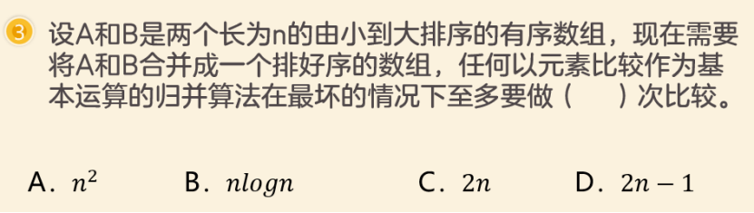

# 初赛知识点汇总

## 计算机基础

### 电子计算机

#### 按年代分类

| 时期 | 形式 |
| :-: | :-: |
| $1946\sim1958$ | 电子管 |
| $1959\sim1964$ | 晶体管 |
| $1965\sim1970$ | 集成电路 |
| $1971\sim\text{N/A}$ | （超）大规模集成电路 |
| 现代 | 智能计算机系统（根据第五版初赛一本通） |

摩尔定律：集成电路上可以容纳的晶体管数目在大约每经过 $18$ 个月到 $24$ 个月便会增加一倍。

#### 按性能分类

巨型机 $>$ 大 / 中型机 $>$ 小型机 $>$ 微型机 $=$ 工作站。

+ 巨型机（超级计算机）：科学研究。

+ 大 / 中型机：顶尖科研领域。

+ 小型机：单位服务器、其他领域。

+ 微型机：个人工作（个人电脑大部分都是微型机）。

+ 工作站：辅助微型机工作。

补：大型机和超级计算机（旧称巨型机）的主要区别:

+ 大型机主要用于商业领域，巨型用于尖端科学领域（特别是国防领域）。

+ 大型机长于非数值计算（数据处理），巨型长于数值计算（科学计算）。

+ 为了确保兼容性，大型机的部分技术较为保守。

+ 大型机使用专用指令系统和操作系统，巨型机使用通用处理器及 UNIX 或类 UNIX 操作系统。

#### 机械式计算机

+ 帕斯卡（法国）：加法机。

+ 莱布尼茨（德国）：改进加法机。

+ 巴贝奇（英国）：分析机。

+ 霍勒瑞斯（美国）：穿孔卡片机。

#### 早期情况

+ 艾伦·图灵（英国）：

	+ 数学家，逻辑学家，计算机科学、人工智能之父，提出图灵测试（*Can Machine Think?*）。

	+ 协助军方破解德国著名密码系统 Enigma，首次提出了计算机科学理论。
	
	+ 计算机界的最高奖项图灵奖（美国计算机协会 ACM 设立）以他命名，被称为计算机界的诺贝尔奖。

+ 冯·诺依曼（美国）：

	+ 科学家，现代计算机之父。
	
	+ 首次提出了存储程序控制原理，称为冯·诺依曼结构。

+ 克劳德·香农（美国）：

	+ 科学家，创造了信息论。
	
	+ 提出了某种信息从一处传送到另一处所需的全部设备所构成的系统。

+ 阿达·洛芙莱斯（英国）：

	+ 数学家，著名诗人拜伦的女儿。

	+ 设计了巴贝奇分析机上解伯努利方程的第一个程序，建立了循环和子程序的概念。

	+ 被称为世界上第一个程序员。

	+ 为纪念 Ada，美国国防部设计的一款通用程序设计语言称为 Ada。

+ 早期电子计算机：

	+ 第一台电子计算机：ENIAC（1946，美国宾夕法尼亚大学）。

	+ 第一台具有储存功能的（第一台冯机）电子计算机：EDVAC。

	+ 均由美国陆军阿伯丁试验场的弹道研究实验室研制。

#### 设备结构

+ CPU：中央处理器，计算机的核心部件，被称为计算机的大脑，出现于 20 世纪 70 年代。

	+ Inter 4004：4 位。

	+ Inter 8086：16 位。

	+ Inter 80286。

	+ Inter 80386：32 位。

	+ Inter 80586 = Inter Pentium 1（64 位）。

	+ 现代：Inter Core，AMD Ryzen。

+ 内存：用于电脑内部的存储，存储在 RAM 里的数据断电后会丢失。

	+ RAM（Random Access Memory）：随机存取存储器，与 CPU 直接交互数据，可随时读写，断电数据全部丢失。

	+ ROM（Read-Only Memory）：只读存储器，只能读出无法写入信息。信息一旦写入后就固定下来，断电数据不会丢失，故又称为固定存储器。

+ 外存：用于处置长期保存的数据，一般处于电脑外部，断电后数据不会丢失。

+ 输入设备：接受外部命令或者需要加工的数据。

+ 输出设备：将处理结果以人类能够识别 / 感受的方式呈现出来的设备。

性能指标：

1. 字长：一次处理的二进制代码位数。

2. 主频：每秒执行的指令条数（称为指令周期）。

总线结构：

1. 数据总线 DB：传送数据信息。

2. 地址总线 AB：传送地址信息。

3. 控制总线 CB：传送控制信号。

存储器访问速度：寄存器 $>$ 高速缓存 $>$ 内存（ROM + RAM）$>$ 外存，断电仅保留 ROM 和外存中的数据。

### 文件和数据

#### 文件扩展名

+ 图像存储：jpg, png, bmp, gif, webp。

+ 音频存储：mp3, wav。

+ 视频存储：mp4, avi, mpeg。

#### ASCII 码

$\texttt{ASCII}$ 码（$\texttt{American Standard Code for Information Interchange}$）是美国国家交换标准代吗。

| 码域 | 字符 | 可见性 |
| :-: | :-: | :-: |
| $0 \sim 31$，$127$ | 控制字符或通信专用字符 | $\texttt{False}$ |
| $32$ | 空格 | $\texttt{False}$ 或 $\texttt{True}$ |
| $48 \sim 57$ | 数字（$\texttt{0} \sim \texttt{9}$） | $\texttt{True}$ |
| $65 \sim 90$ | 大写字母（$\texttt{A} \sim \texttt{Z}$） | $\texttt{True}$ |
| $97 \sim 122$ | 小写字母（$\texttt{a} \sim \texttt{z}$） | $\texttt{True}$ |
| 其他（$33 \sim 47$，$58 \sim 64$，$94 \sim 96$，$126$） | 特殊字符 | $\texttt{True}$ |
| 拓展（$128 \sim 255$） | 拓展的 $\texttt{ASCII}$ 码 | $\texttt{N/A}$ |

#### 机器数与真值

正数：［原码 $=$ 反码 $=$ 补码］。

负数：［反码 $=$ 除符号位外，原码的各位全部取反］［补码 $=$ 反码 $+1$］。

#### 软件

软件是一系列按照特定顺序组织的计算机数据和指令的集合。

一般来讲软件被划分为系统软件、应用软件和介于这两者之间的中间件。

+ 应用软件

	+ 办公室软件

		+ 文本编辑器：vim, notepad

		+ MS-Office, LibreOffice, WPS Office

	+ 互联网软件

		+ 即时通讯：QQ, WeChat

		+ 浏览器：Google Chrome, Microsoft Edge

		+ 下载器：IDM, Motrix

	+ 多媒体软件

		+ 媒体播放器：VLC, SMPlayer

		+ 图像编辑器：mspaint, PaintTool SAI

		+ 计算机游戏

	+ 分析软件

		+ CAS, CAE

	+ 协作软件

	+ 商务软件

+ 系统软件：处理机管理、储存管理、设备管理、信息管理。

	+ 操作系统

		+ 桌面操作系统：

			+ Unix 和类 Unix 系统：Mac OS X，Linux 发行版（如 Debian, Ubuntu, Linux Mint, Fedora, Mandrake, Red Hat, Centos）。

			+ Windows 系统：Windows 98 / 2000 / XP / Vista / 7 / 8 / 8.1 / 10 / 11。

		+ 服务器操作系统：

			+ Unix 系列：FreeBSD, OS X Server。

			+ Linux 系列：Red Hat Linux, CentOS, Debian, Ubuntu Server。

			+ Windows 系列：Windows NT Server, Windows 2003 / 2008 / 2012 Server, Windows Server Technical。
		
		+ DOS, MS/2, Android, iOS, 鸿蒙

	+ 语言处理程序

		+ GCC

		+ Clang
	
	+ 数据库管理

		+ Oracle

		+ MySQL

		+ SQL Server

		+ FoxBase, Visual FoxPro

#### 图片与视频大小问题

### 网络

* 局域网：$\texttt{LAN}$（$\texttt{Local Area Network}$），$\le 1 \text{ } \texttt{km}$，结构简单、范围小，短距离传输效率极高
* 城域网：$\texttt{MAN}$（$\texttt{Metropolitan Area Network}$），$1 \sim 10 \text{ } \texttt{km}$
* 广域网：$\texttt{WAN}$（$\texttt{Wide Area Network}$），$10 \sim 1000 \text{ } \texttt{km}$
* 万维网：$\texttt{WWW}$（$\texttt{World Wide Web}$），全球范围

Internet 起源于 APRANET。

- IPv4:32 位，2011 年分配完毕。

- IPv6：128 位。

其他协议：

+ 传输相关

	* 传输控制协议：$\texttt{TCP}$（$\texttt{Transmission Control Protocol}$）
	* 用户数据报协议：$\texttt{UDP}$（$\texttt{User Datagram Protocol}$）

+ 应用相关

	* 超文本传输协议：$\texttt{HTTP}$（$\texttt{Hyper Text Transfer Prtcl}$）
	* 超文本传输协议：$\texttt{HTTPS}$（$\texttt{ - over Securesocket ayer}$），增加了传输加密和身份认证
	* 文件传输协议：$\texttt{FTP}$（$\texttt{File Transfer Protocol}$）
	* 对等网络：$\texttt{P2P}$（$\texttt{peer-t(w)o-peer}$）

+ 邮件相关

	* 简单邮件传输协议：$\texttt{SMTP}$（$\texttt{Simple Mail Transfer Protocol}$）
	* 邮局协议 ：$\texttt{POP}$（$\texttt{Post Office Protocol}$）
	* 邮局协议第三版 ：$\texttt{POP3}$（$\texttt{Post Office Protocol - Version 3}$）
	* 交互邮件访问协议：$\texttt{IMAP}$（$\texttt{Internet Message Access Protocol}$）

### 语言的分类

+ 低级语言：

	+ 机器语言 / 机器码：

		+ 最早的语言，计算机能识别的语言。
		
		+ 由二进制数字 0/1 组成，速度极快，人类编码难度高，一般由计算机自动转换。

	+ 汇编语言：

		+ 用符号代替二进制数，计算机不能直接识别，需要用编译器进行编译。
		
		+ 早期语言，难度依然很大，目前除了对性能要求极高的需求以外不被使用。

+ 高级语言：

	+ 现代的编程语言（C++，JAVA 等），需要用编译器或解释器，难度小。

	+ 编译方式：C / C++, Pascal, Object Pascal (Delphi)
	
		+ 先对整个程序进行编译（会进行多次分析），再执行程序。
		
		+ 速度快（进行多次编译对程序进行优化）。

	+ 解释方式：ASP, Java, C#, PHP, JavaScript, VBScript, Perl, Python, Ruby, MATLAB
	
		+ 扫描一行解释一行，速度慢（无法进行优化）。

		+ 注：某些语言可以预先编译或者直接使用 C 语言编写库文件。
	
	+ 面向对象语言：

		+ 第一个：Simula67。

		+ 第二个：Smalltalk。

### Linux 基础操作

+ 文件操作：

	+ 列出文件：`ls`
	+ 列出隐藏文件：`ls -a`
	+ 列出文件及大小：`ls -l`
	+ 重命名文件：`mv old.cpp new.cpp`
	+ 创建备份：`cp file.cpp file.cpp.bak`
	+ 查看目录地址：`pwd`
	+ 切换上级目录：`cd ..`
	+ 切换目录：`cd dirx`
	+ 创建目录：`mkdir dirx`
	+ 删除目录：`rm -r dirx`

+ 程序操作：

	+ 运行程序：`./test`
	+ 计时运行：`time ./test`
	+ 重定向输入输出：`test<in.txt>out.txt`
	+ 查看所有进程：`ps`
	+ 杀掉后台进程：`killall test`
	+ 终止进程：`kill $pid`
	+ 强制终止运行：`Ctrl-C`
	+ 输入结尾（EOF）：`Ctrl-Z`

+ 编译指令：

	+ 生成调试信息：`-g`
	+ 生成目标文件：`-c`
	+ 生成可执行文件：`-o`
	+ 包含 cmath 库：`-lm`
	+ 显示警告：`-Wall`
	+ 缺氧、氧气优化：`-O0，-O2`
	+ C++14：`-std=c++14`

### 计算机安全

#### 硬件安全

防震、防水、防化学腐蚀。

#### 储存安全

计算机病毒、非法访问、电磁辐射、硬件损坏。

#### 计算机病毒

1. 繁殖性。

2. 破坏性。

3. 传染性。

4. 潜伏性。

5. 隐蔽性。

6. 可触发性。

#### 保护措施

1. 安装杀毒软件。

2. 安装个人防火墙。

3. 设置密码。

4. 不下载不明程序。

5. 防范流氓软件。

6. 定期备份。

## 算法基础

### 程序基本常识

算法的重要特征：

1. 有穷性。

2. 确定性。

3. 输入、输出。

4. 可行性。

### 逻辑表达式

逻辑表达式：由逻辑运算组合而成，返回值只有 $\texttt{True}$ 和 $\texttt{False}$，其中 $0$ 表示假、非 $0$ 表示真。

如果逻辑表达式由多个组合，需要［从右往左］依次判断，最后得出答案。这种性质被称为［右结合性］，例如：

> <表达式1>?<表达式2>:<表达式3>?<表达式4>:<表达式5>
> 
> 执行的时候是从表达式 $3$ 开始判断是否为真，然后从右往左执行每一个表达式，依次向上回溯，最后得出答案。

### 复杂度分析

符号：$T(n)$ 表示时间复杂度，$T(n) = $ 后跟一个符号，例：$T(n) = \mathcal{O}(n^2)$。

| 符号 | 英文名称 | 意义 |
| :-: | :-: | :-: |
| $\Theta$ | `theta` | 等于 |
| $\mathcal{O}$ | `big-oh` | 小于等于 |
| $\Omega$ | `big-omega` | 大于等于（不常用） |
| $o$ | `small-oh` | 小于（不常用） |
| $\omega$ | `small omega` | 大于（不常用） |

详见：<https://oi-wiki.org/basic/complexity/>。

### 基础算法

下面来自一本通，分类并不唯一。

1. 高精度计算。

2. 穷举算法。

3. 数据排序。

4. 递推算法。

5. 递归算法。

6. 搜索和回溯算法。

7. 贪心算法。

8. 分治算法。

9. 动态规划。

### 数据结构

#### 栈

只能在某一段插入和删除的特殊线性表。

+ PUSH

+ POP

#### 队列

在一段插入，另一端删除的特殊线性表。

+ PUSH

+ POP

### 排序算法

基于比较：通过比较元素来排序数列，如冒泡排序，快速排序等；

不基于比较：不比较元素，通过其他方法来进行排序，如基数排序等。

|  | 选择排序 | 冒泡排序 | 插入排序 | 快速排序 | 归并排序 |
| :------------: | :------------: | :------------: | :------------: | :------------: | :------------: |
| **平均复杂度** | $\mathcal{O}(n^2)$ | $\mathcal{O}(n^2)$ | $\mathcal{O}(n^2)$ | $\mathcal{O}(n \log n)$ | $\mathcal{O}(n \log n)$ |
| **最坏复杂度** | $\mathcal{O}(n^2)$ | $\mathcal{O}(n^2)$ | $\mathcal{O}(n^2)$ | $\mathcal{O}(n^2)$ | $\mathcal{O}(n \log n)$ |
| **最好复杂度** | $\mathcal{O}(n^2)$ | $\mathcal{O}(n)$ | $\mathcal{O}(n)$ | $\mathcal{O}(n \log n)$ | $\mathcal{O}(n \log n)$ |
| **稳定性** | 不稳定 | 稳定 | 稳定 | 不稳定 | 稳定 |
| 空间复杂度 | $\mathcal{O}(1)$ | $\mathcal{O}(1)$ | $\mathcal{O}(1)$ | $\mathcal{O}(n)$ | $\mathcal{O}(n)$ |

|  | 希尔排序 | 堆排序 | 基数排序 |
| :------------: | :------------: | :------------: | :------------: |
| **平均复杂度** | $\mathcal{O}(n^{1.3})$ | $\mathcal{O}(n \log n)$ | $\mathcal{O}(d \times (n + w))$ |
| **最坏复杂度** |  | $\mathcal{O}(n \log n)$ | $\mathcal{O}(d \times (n + w))$ |
| **最好复杂度** |  | $\mathcal{O}(n \log n)$ | $\mathcal{O}(d \times (n + w))$ |
| **稳定性** | 不稳定 | 不稳定 | 稳定 |
| 空间复杂度 | $\mathcal{O}(1)$ | $\mathcal{O}(1)$ | $\mathcal{O}(w)$ |

### 图论基础

+ 定义：图是一个二元组 $G=(V,E)$。

	+ 其中 $V$ 是非空集，称为点集，对于 $V$ 中的每个元素，我们称其为顶点或节点，简称点。

	+ 其中 $E$ 为 $v$ 各结点之间边的集合，称为边集。

	+ 当 $V,E$ 都是有限集合时，称 $G$ 为有限图，否则为无限图。

	+ 图 G 的点数 $|V|$ 也被称作图 $G$ 的阶。

	+ 子图：对一张图 $G = (V, E)$，若存在另一张图 $H = (V', E')$ 满足 $V' \subseteq V$ 且 $E' \subseteq E$，则称 $H$ 是 $G$ 的 子图，记作 $H \subseteq G$。

	+ 反图：对于有向图 $G = (V, E)$，它的反图指的是点集不变，每条边反向得到的图，即：若 $G$ 的反图为 $G'=(V, E')$，则 $E'=\{(v, u)|(u, v)\in E\}$。

+ 无向图、有向图：

	+ 无向图：

		+ 若 $G$ 为无向图，则 $E$ 中的每个元素为一个无序二元组 $(u, v)$。
		
		+ 称 $(u, v)$ 为无向边（简称边），点 $u,v$ 称为端点。
	
	+ 有向图：

		+ 若 $G$ 为有向图，则 $E$ 中的每一个元素为一个有序二元组 $(u, v)$，有时也写作 $u \to v$。
		
		+ 称 $(u, v)$ 为有向边（简称弧），在不引起混淆的情况下也可以称作边。
		
		+ 点 $u,v$ 称为端点，且称 $u$ 为 $v$ 的前驱、$v$ 为 $u$ 的后继。

	+ 若 $G$ 为混合图，则 $E$ 中既有有向边，又有无向边。

+ 重边和自环：

	+ 自环：对 $E$ 中的边 $e = (u, v)$，若 $u = v$，则 $e$ 被称作一个自环。

	+ 重边：若 $E$ 中存在两个完全相同的元素（边）$e_1, e_2$，则它们被称作（一组）重边。

	+ 简单图：若一个图中没有自环和重边，它被称为简单图；反之称为多重图。

	+ 根据鸽巢原理：具有至少两个顶点的简单无向图中一定存在度相同的结点。

+ 度数：

	+ 与一个顶点 $v$ 关联的边的条数称作该顶点的度，记作 $\deg(v)$，自环产生两次贡献。

	+ 握手定理（图论基本定理）：无向图 $G = (V, E)$ 有 $\sum_{v\in V}\deg(v) = 2|E|$。

	+ 推论：在任意图中，度数为奇数的点必然有偶数个。

+ 路径：

	+ 途径：
	
		+ 连接一连串顶点的边的序列，可以为有限或无限长度。
		
		+ 一条有限途径 $w$ 是一个边的序列 $e_1, e_2, \ldots, e_k$，使得存在一个顶点序列 $v_0, v_1, \ldots, v_k$ 满足 $e_i = (v_{i-1}, v_i)$，其中 $i \in [1, k]$，简写为 $v_0 \to v_1 \to v_2 \to \cdots \to v_k$。
		
		+ 无权图边的数量 $k$ 被称作这条途径的长度；带权图长度通常指途径上的边权之和（题目中也可能另有定义）。

	+ 迹：对于一条途径 $w$，若 $e_1, e_2, \ldots, e_k$ 两两互不相同，则称 $w$ 是一条迹。

	+ 路径（又称简单路径）：对于一条迹 $w$，若其连接的点的序列中点两两不同，则称 $w$ 是一条路径。

	+ 回路：对于一条迹 $w$，若 $v_0 = v_k$，则称 $w$ 是一条回路。

	+ 环（又称，圈，简单回路，简单环）：对于一条回路 $w$，若 $v_0 = v_k$ 是点序列中唯一重复出现的点对，则称 $w$ 是一个环。

+ 欧拉（回）路：

	+ 存在一笔画，称为欧拉路，回到起点为欧拉回路。

	+ 存在欧拉路的条件：联通且 $\deg$ 为奇数的点只有两个。

	+ 存在欧拉回路的条件：联通且 $\deg$ 为奇数的点有 $0$ 个，

+ 连通性：

	+ 无向图：

		+ 对于一张无向图 $G = (V, E)$，对于 $u, v \in V$，若存在一条途径使得 $v_0 = u, v_k = v$，则称 $u$ 和 $v$ 是连通的。

		+ 连通图：无向图 $G = (V, E)$，满足其中任意两个顶点均连通（连通性）。

		+ 若 $H$ 是 $G$ 的一个连通子图，且不存在 $F$ 满足 $H\subsetneq F \subseteq G$ 且 $F$ 为连通图，则 $H$ 是 $G$ 的一个连通块或连通分量（极大连通子图）。
	
	+ 有向图：

		+ 对于一张有向图 $G = (V, E)$，对于 $u, v \in V$，若存在一条途径使得 $v_0 = u, v_k = v$，则称 $u$ 可达 $v$。

		+ 强连通：有向图的节点两两互相可达。

		+ 弱连通：有向图的边替换为无向边后可以得到一张连通图。

		+ 与连通分量类似，也有弱连通分量（极大弱连通子图）和强连通分量（极大强连通子图）。
	
	+ 割：

		+ 对于连通图 $G = (V, E)$，若 $V'\subseteq V$ 且 $G' = (V\setminus V', E)$ 不是连通图，则 $V'$ 是图 $G$ 的一个点割集，大小为一的点割集又被称作割点。

		+ 对于连通图 $G = (V, E)$，若 $E'\subseteq E$ 且 $G' = (V, E\setminus E')$ 不是连通图，则 $E'$ 是图 $G$ 的一个边割集，大小为一的边割集又被称作桥。

+ 完全图：

	+ 完全图：无向简单图 G 满足任意不同两点间均有边。

	+ 有向完全图：有向图 G 满足任意不同两点间都有两条方向不同的边。

	+ 竞赛图：有向简单图 G 满足任意不同两点间都有恰好一条单向边。

+ 特殊的集：

	+ 覆盖集：

		+ 点覆盖 $V'$：图 $G=(V, E)$，若 $V'\subseteq V$ 且 $\forall e\in E$ 满足 $e$ 的至少一个端点在 $V'$ 中。

		+ 边覆盖 $E'$：图 $G=(V, E)$，若 $E'\subseteq E$ 且 $\forall v\in V$ 满足 $v$ 与 $E'$ 中的至少一条边相邻。
	
	+ 独立集：

		+ 独立集 $V'$：图 $G=(V, E)$，若 $V'\subseteq V$ 且 $V'$ 中任意两点都不相邻。

		+ 边独立集（匹配）$E'$：图 $G=(V, E)$，若 $E'\subseteq E$ 且 $E'$ 中任意两条不同的边都没有公共的端点，且 $E'$ 中任意一条边都不是自环。
	
	+ 支配集：

		+ 支配集 $V'$：无向图 $G=(V, E)$，若 $V'\subseteq V$ 且 $\forall v\in(V\setminus V')$ 存在边 $(u, v)\in E$ 满足 $u\in V'$。

		+ 边支配集 $E'$：图 $G=(V, E)$，若 $E'\subseteq E$ 且 $\forall e\in(E\setminus E')$ 存在 $E'$ 中的边与其有公共点。

	+ 点覆盖集必为支配集，但极小点覆盖集不一定是极小支配集。一个点集是点覆盖的充要条件是其补集是独立集，因此最小点覆盖的补集是最大独立集。

	+ 最大匹配也可以由最小边覆盖求得：对于最小边覆盖中每对有公共点的边删去其中一条。一张图的最小边覆盖的大小加上最大匹配的大小等于图的点数

+ 树的定义：

	+ 有 $n$ 个结点，$n-1$ 条边的连通无向图。

	+ 无向无环的连通图。

	+ 任意两个结点之间有且仅有一条简单路径的无向图。

	+ 任何边均为桥的连通图。

	+ 没有圈，且在任意不同两点间添加一条边之后所得图含唯一的一个圈的图。

+ 树的性质：

	+ 对于无根树和有根树：

		+ 森林：每个连通分量（连通块）都是树的图，一棵树也是森林。

		+ 生成树：一个连通无向图的生成子图，同时要求是树。也即在图的边集中选择 $n - 1$ 条，将所有顶点连通。

		+ 叶结点：

			+ 无根树：度数不超过 1 的结点。

			+ 有根树：没有子结点的结点。

	+ 对于有根树：

		+ 父亲：对于除根以外的每个结点，定义为从该结点到根路径上的第二个结点，根结点没有父结点。

		+ 祖先：一个结点到根结点的路径上，除了它本身外的结点，根结点的祖先集合为空。

		+ 子结点：如果 $u$ 是 $v$ 的父亲，那么 $v$ 是 $u$ 的子结点。子结点的顺序一般不加以区分，二叉树是一个例外。

		+ 结点的深度：到根结点的路径上的边数。

		+ 树的高度：所有结点的深度的最大值。

		+ 兄弟：同一个父亲的多个子结点互为兄弟。

		+ 后代：子结点和子结点的后代。如果 u 是 v 的祖先，那么 v 是 u 的后代。

		+ 子树：删掉与父亲相连的边后，该结点所在的子图。
	
+ 树的遍历：

	+ 先序遍历：根，左，右。

	+ 中序遍历：左，根，右。

	+ 后序遍历：左，右，根。

	+ 层次遍历：树上 BFS。

	+ 表达式树：二叉树，先序对应前缀（波兰式），中序对应中缀，后序对应后缀表达式（逆波兰式）。

+ 二叉树的性质：

	+ 第 $i$ 层最多 $2^{i-1}$ 个节点。

	+ 深度为 $k$ 最多有 $2^k-1$ 个节点。

	+ $n_0=n_2+1$。

	+ 有 $n$ 个节点的完全二叉树深度为 $\lfloor\log_2n\rfloor+1$。

+ 特殊的图：

	+ 如果一张无向连通图包含恰好一个环，则称它是一棵基环树。

	+ 如果一张有向弱连通图每个点的入度都为 $1$，则称它是一棵基环外向树。

	+ 如果一张有向弱连通图每个点的出度都为 $1$，则称它是一棵基环内向树。

	+ 多棵树可以组成一个森林，多棵基环树可以组成基环森林，多棵基环外向树可以组成基环外向树森林，多棵基环内向树可以组成基环内向森林。

	+ 如果一张无向连通图的每条边最多在一个环内，则称它是一棵仙人掌，多棵仙人掌可以组成沙漠。

	+ 二分图：
	
		+ 二分图：一张图的点集可以被分为两部分，每一部分的内部都没有连边。
		
		+ 完全二分图：二分图中任何两个不在同一部分的点之间都有连边。

## 数学问题

详见：[https://www.luogu.com.cn/blog/334586/csp-pre-knowledge](https://www.luogu.com.cn/blog/334586/csp-pre-knowledge#:~:text=%E6%95%B0%E5%AD%A6-,%E6%95%B0%E5%AD%A6,-%E6%9C%80%E5%A4%A7%E5%85%AC%E7%BA%A6%E6%95%B0)

### 排列组合

* 排列 $A(n, m)$，旧时写作 $P(n, m)$：

	$\displaystyle A(n, m) = \frac{n!}{(n - m)!}$

* 组合 $C(n, m)$，也写作 $\displaystyle \binom{n}{m}$：

	$\displaystyle C(n, m) = \frac{A(n, m)}{A(m, m)} = \frac{n!}{m!(n - m)!}$

* 错排列问题：

	$D_1 = 0$，$D_2 = 1$，$D_n = (n - 1)(D_{n - 1} + D_{n - 2})$

* Lucas 定理：

	$\displaystyle \binom{n}{m} = \binom{n \bmod p}{m \bmod p}\binom{n / p}{m / p}$，其中 $p$ 为质数

* Catalan 数：

	$\displaystyle C(n) = \binom{2n}{n} - \binom{2n}{n - 1} = \frac{1}{n + 1} \binom{2n}{n}$

* 二项式定理：

	$\displaystyle (x + y)^k = \sum_{i = 0}^{k} C(n, i) x^i y^{k - i}$

### 概率与统计

* 独立事件（即两事件的结果不会相互影响）：

	$P(A \cap B) = P(A) \times P(B)$

* 古典公式：

	$P(A) = \dfrac{|A|}{S}$

* 贝叶斯公式：

	$P(A \mid B) = \dfrac{P(A \cap B)}{P(B)}$

* 数学期望：

	$\displaystyle E(x) = \sum_{i = 1}^\infty x_i p_i$

### 线性代数

* 矩阵：

	

* 矩阵乘法 $O(nmr)$：

	设 $A = (a_{ij})_{n \times m}$，$B = (b_{ij})_{m \times r}$，
	设 $C = A \times B = (c_{ij})_{n \times r}$，
	则 $\displaystyle c_{ij} = \sum_{k = 1}^{m} a_{ik}b_{kj}$
	
	

### 方格路径

题目：有 $n \times m$ 的方格，从 $(1, 1)$ 出发，只能向右、下走，求走到 $(n, m)$ 的方案数。

1. 递推法

	每个格子可以从上面和右面转移过来，这是一个非常基础的 DP 问题：$f(i, j) = f(i - 1, j - 1) + f(i - 1, j)$.

2. 组合数学法

	$C(n + m - 2, n - 1)$ 或 $C(n + m - 2, m - 1)$.
	
	证明：一共要走 $n + m - 2$ 步，其中 $n - 1$ 个下，$m - 1$ 个右，随时都能向右走，证毕。

3. 扩展

	从 $(a, b)$ 走到 $(c, d)$，路径数为 $C(c - a + d - b, c - a)$ 或 $C(c - a + d - b, d - b)$.

### 其他

* 对数恒等式：

	* $\log_kn = \dfrac{\log_xn}{\log_xk}$

* 整数溢出：

	signed 溢出是 Undefined Behavior（UB），是否取会模取决于编译器；
	unsigned 溢出是 Define Behavior（DB），在溢出时自动取模。

* 模等式：

	* 对于 $m \bmod n = p$：
		* 若 $m > n$，则 $0 \le p <n$；
		* 若 $m = n$，则 $p = 0$；
		* 若 $m < n$，则 $p = m$；
	* 所以 $p \le \min(m, n)$

## 拿分技巧

以下大多来自学而思 <https://mp.weixin.qq.com/s/fk9B6pTA_33aZbHp8fcw9A>。

普通单选题就是一个题面一道题四个选项，主要是从五个方面来考察，分别是：计算机基础常识、C++ 语法、基本算法理论、数据结构、数学基础。本文主要详述一下这些题适用的拿分技巧，包括：排除法、特殊值代入法、极值法等，除此之外在一些代码题中也可以用模拟法，模拟法会在下文详述。

长篇代码题就是给一段代码，然后需要回答若干道与之相关的客观题，给出的代码可以是完好的（阅读程序题），也可以是残缺的（完善程序题）。对于这些题，我们能用的技巧有：模拟法、模仿相似代码法、相关变量法、经典算法实现、参考文字提示、特殊数据带入法、排除法、反例法等。

#### 排除法

这道题当年很多同学不敢肯定 A 是对的，但是呢，由于 BCD 错得离谱，所以就算你再不确定 A 是不是对的，由于其他选项都被排除了，也就只好选 A 了。

#### 极值法

本题是一个抽象的规律题，理论上对于任何符合条件的数，这个规律都能成立，故而我们可以代入一些极为特殊的数，从而能直接简化整个题目的难度等级，比如代入 $n = 1$，则数组被简化为 $1 \times 1$ 的数组，只有 $1$ 个元素：a[0][0]。

此时，这个元素的前面没有任何元素，即，有 $0$ 个元素。然后把 $i = 0$ 和 $j = 0$ 代入四个选项，能够快速得到 A 为 $-1$、D 为 $1$ 都是不符合题意的选项，均可以快速排除。至于 B 和 C 选项，我们只需要再代入一个稍复杂的矩阵（如 $3 \times 4$）的就能轻松解决问题~

在上述实操中，我们使用了一个特殊极值，将题目化简为了一个极为简单的情况（从二维变成了一维），从而快速排除掉一半的选项，将随机选择的正确率从 $25\%$ 一下就提高到了 $50\%$，这道题的原意本来是想考察我们对二维数组存储的理解深度，但是如果你对二维数组的了解不深，通过这种极值简化和排除的办法，也能极大提高得分概率。

#### 代入法

我们可以代入一些特殊的数据，来猜测什么样的数组合并时，比较次数最多，并算出最多的比较次数。

比如，如果是 a 数组 $[1, 2, 3]$ 和 b 数组 $[4, 5, 6]$ 两个数组，我们发现首先 $1$、$2$、$3$ 分别需要和 $4$ 比较一次后放入结果数组，然后由于 a 数组已经没有了可比较元素了，b 数组就直接按顺序放入结果数组即可，所以比较次数只需要 $3$ 次，即 n 次即可。

这样显然太顺利了，而题目问的是至多多少次，所以我们可以构造一个运气不太好的数组，如 a 为 $[1, 3, 5]$，b 为 $[2, 4, 6]$，这样 $1$ 需要和 $2$ 比较，然后放入结果数组，$2$ 需要和 $3$ 比较、$3$ 需要和 $4$ 比较等等。

以此类推，合并这两个数组需要比较 $5$ 次，咱们可以随意增大数组长度找规律，可知需要比较 $2n – 1$ 次。而且由于除了最后一个元素外，每个元素进数组前都要比较一次，比较得很充分，没有其他情况能比这种情况比的次数更多了，故而得到本题答案选 D。这样代入具体例子肯定比同学们在理论层面推要快，要直观，更不容易错，对吧？

#### 模拟法

若变量个数过多，或程序变化过于复杂，随手写的过程中容易稍不留神就出错时，则可以考虑设计表格来展示所有数据。模拟时，遇到常见的变量名和算法结构时，可以大胆地根据变量名、算法结构猜测其作用，再根据模拟的结果小心验证，这样能够提高做对的概率，并且极大减少我们模拟时的工作量~

常见的变量名如下：

对于常见的算法结构，大家可以重点关注一些算法的典型结构：二分、计数排序、连续字符判断（字符转数字）、链表、分治、二叉树等。此处限于篇幅就不详细列出每种结构了，请大家一定要对照代码，仔细总结。

虽然模拟法非常有用，但是比较依赖各位同学扎实的代码能力，对于非常复杂的题，代码能力弱的同学可能会模拟得非常吃力，还容易出错，所以下述技巧其实才是咱们“骗分”的主力！

#### 模仿相似代码法

在我们编写程序的时候，常常会出现相似度很高的代码，它们通常是对不同的对象做相同或者相似的处理。这种现象常常出现在枚举、分治或者树结构相关的程序上。当我们需要补全语句时，参考与它相似的段落往往会给我们带来很多提示和启发。

方法举例：

通过题目可知，本题代码考察的是二叉树结构。在代码里，你能发现相似的地方不？16行和17行的代码是比较相似的吧？从 $17$ 行的 `a[root].rch` 来看，我们不难猜出，这里应该是要遍历它的右子树，那么 $16$ 行应该是要遍历什么呢？自然是左子树，所以标号为 ② 这个空的答案呼之欲出：自然是 `a[root].lch`。

通过 $16$ 行可知，左子树的范围是 `lower_bound` 到 `cur`，那么 ③④ 空右子树的范围是啥呢？肯定从 `cur` 左右开始，到 `upper_bound`。为啥是 `upper_bound` 呢？因为一查字典就知道，`lower_bound` 是下界（下限/最小值），所以与之对应的词，习惯上一般称为 `upper_bound`（上界）。经过此番严谨而大胆的猜测后，下面的几题你会选了么？

当然，你要是觉得用技巧的猜测过于大胆了，不放心的话，在时间富裕的情况下，可以再用模拟法代入具体数值小心验证一下。

#### 经典算法实现

很多题目，特别是完善程序题的题目都会涉及到一个或多个具体的算法，而很多算法是有明显的经典代码特色的。因此，咱们可以利用算法本身约定俗成的写法就能快速解题！

方法举例：

本题的 $1$、$2$ 空一看就是在求所有的约数，结合题目要求复杂度为 $O(\sqrt n)$，我们根据过往求解因数个数等的模板可知，$1$ 空为 `i * i`（因为约数是成双成对的，找到 $\sqrt n$ 就行了），$2$ 空为 `n / i`，这是为了避免完全平方数有一个无法成对的约数情况（如，$36$ 的约数 $6$ 没有与之配对的不同的约数了）。

本题的 $3$、$4$ 空根据函数名和题目描述可知，其作用是求最大公约数的函数，结合题目要求复杂度为 $O(\log \max(a, b))$，不难发现，这是考辗转相除法的递归版本，所以 $3$ 为 `return a`、$4$ 为 `a % b`。

#### 反例法

此方法通常用在判断题里，根据题目给的条件，只要能举出一个反例，那么题目所描述的内容就会不成立。

方法举例：

比如，题目说：数组 a[i] 必须全为正整数，否则程序将选入死循环。那我们就可以将 $0$ 或者负整数代入 a 数组，看看会不会死循环，只要能找到一个反例，那么这道题的描述的情况就不成立。当然，由于只需要找到一个反例，所以我们可以代入尽可能简单的数，比如 $0$ 或 $-1$，这样就能快速算出答案。
