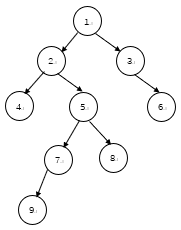

# 树论基础

## DFS序、时间戳和欧拉序

### 下文图例



DFS 序：1 2 4 5 7 9 8 3 6.

欧拉序(2)：1 2 4 4 5 7 9 9 7 8 8 5 2 3 6 6 3 1.

*欧拉序(1)*：1 2 4 2 5 7 9 7 5 8 5 2 1 2 3 6 3 1.

下文举例均指此图。

### DFS 序

周所周知，DFS 为深度优先遍历，其框架如：

```cpp
void dfs(int u, int fa) {
	for (int v : g[u])
	if (v != fa) dfs(v, u);
}
```

而 DFS 序就表示，DFS 遍历节点的顺序。

比如第 3 个遍历到的节点为 Q，则 DFS 序的第三个就是 Q。

其框架表示为：

```cpp
void dfs1(int u, int fa) {
	em.push_back(u);
	for (int v : g[u])
		if (v != fa) dfs(v, u);
}
```

举例：上图的 DFS 序即为：1 2 4 5 7 9 8 3 6.

### DFN 序

一般认为 DFN 序与 DFS 序等价，或者 DFN 序是 DFS 序的逆。

这里采取第二种看法。

也就是 DFS 序的第 $i$ 项（序列的第 $i$ 个元素）的 DFN 为 $i$。

也就是，DFS 序是遍历的顺序，一个序列，记录第 $x$ 个访问的是什么。

而 DFN 序则是记录第 $i$ 个元素什么时候（$x$）访问的。

### 欧拉序 (2)

*为什么后面有个 (2)？看下一个，有 (1) 你就知道了* .

通常认为的欧拉序为，记录每个节点入栈、出栈的顺序。

特性：叶子结点回被记录两次。

其框架表示为：

```cpp
void dfs2(int u, int fa) {
	em.push_back(u);
	for (int v : g[u])
		if (v != fa) dfs(v, u);
	em.push_back(u);
}
```

举例：上图的 欧拉序 序即为：1 2 **4 4** 5 7 **9 9** 7 **8 8** 5 2 3 **6 6** 3 1.

### 欧拉序 (1)

但是这个东西，似乎只有在 st 表求 LCA 的时候能用上（）

*当然本人水平不够*，具体情况具体分析（）

回加是我给加的形容词，之所以叫回加，是因为在 DFS 的过程中，当回到一个节点，也记录一次。

特性：叶子结点遍历完直接回到父亲节点，不重复记录。

同时，因为这个特性，当一个节点出栈的时候，不记录，因此叶子节点不会像欧拉序那样出现两次。

```cpp
void dfs3(int u, int fa) {
	em.push_back(u);
	for (int v : g[u]) {
		if (v != fa) dfs(v, u);
		em.push_back(u);
} }
```

举例：上图的 欧拉序(1) 序即为：1 **2 4 2** 5 **7 9 7** **5 8 5** 2 1 2 **3 6 3** 1.

## 附：DFS 生成树

见：<https://oi-wiki.org/graph/scc/#dfs-%E7%94%9F%E6%88%90%E6%A0%91>。

后期如果写 Tarjan 的时候再写。

## Reference

[1] <https://www.cnblogs.com/stxy-ferryman/p/7741970.html>  
[2] <https://zhuanlan.zhihu.com/p/467156796>
